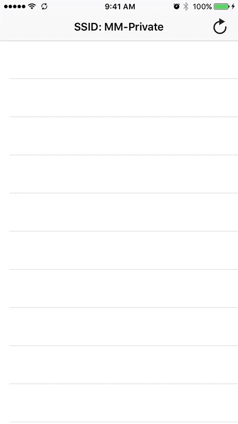

MMLanScan
======

MMLanScan is an open source project for iOS that helps you scan your network and shows the available devices and their MAC Address.

### Screenshot


###Features
+ Scans and finds available hosts in your network
+ Shows IP Address
+ Shows MAC Address
+ Scan any subnet (not only /24)

###Installation
- Drag n Drop the MMLanScan folder in your project.

###How to use it

Import MMLANScanner in your controller
```
#import "MMLANScanner.h"
```

Add the MMLANScannerDelegate to your controller
```
@interface YourViewController () <MMLANScannerDelegate>
```

Declare a property
```
@property(nonatomic,strong)MMLANScanner *lanScanner;
```

Start the scan
```
[self.lanScanner stop];
self.lanScanner = [[MMLANScanner alloc] initWithDelegate:self];
self.connectedDevices = [[NSMutableArray alloc] init];    
[self.lanScanner start];
```

Implement the delegates methods to receive events
```
- (void)lanScanDidFindNewDevice:(Device*)device;
- (void)lanScanDidFinishScanning;
- (void)lanScanProgressPinged:(NSInteger)pingedHosts from:(NSInteger)overallHosts;
- (void)lanScanDidFailedToScan;
```

###How it works
MMLanScan works like the classic network scanner. It first ping every host in the network in order to built the ARP table and then is trying to get the MAC Address for each host. If a MAC Address is found then it's considered that the host exist in the network.

###Libraries used to built MMLanScan
- Apples [SimplePing] (https://developer.apple.com/library/mac/samplecode/SimplePing/Introduction/Intro.html) 
- Chris Hulbert's [SimplePingHelper] (https://github.com/chrishulbert/SimplePingHelper) 
- My [MacFinder] (https://github.com/mavris/MacFinder)
- Inspired from [LAN-Scan] (https://github.com/mongizaidi/LAN-Scan) 

###Technical Stuff
Do not update SimplePingHelper since is modified to work with MMLanScan 


###TODO
If anyone would like to help:
- Convert the [OUI] (https://standards.ieee.org/develop/regauth/oui/oui.txt) text in a dictionary so we can map MAC Address with vendor (Hint: The Regex to catch the first line with MAC Address and vendor: ```[A-F0-9]{2}-[A-F0-9]{2}-[A-F0-9]{2}\s*\(hex\)\s*[A-Za-z\.\, \-]+```)
- Make it work in a background thread. Apple's SimplePing has issues when it comes to GCD (it's built on C libraries and it seems their callbacks won't work with GCD)
- Get hostname from IP address method is not working

###Performance Tips
If you experience UI issues (UI not responsive) try to change the value of ```const float interval = 0.3;``` in MMLANScanner
###Authors
* Michael Mavris

###License

Copyright Miksoft 2016

Licensed under the MIT License
